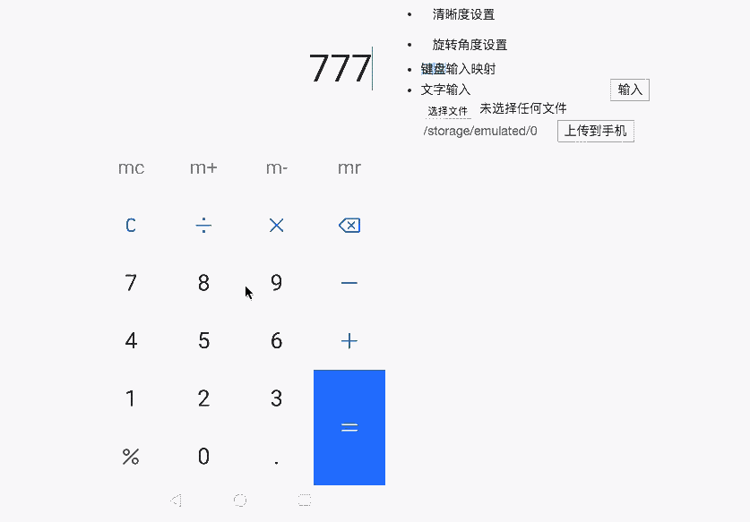

# AndroidControl

即将更名为**RemoteControl**，因为即将支持iphone的屏幕实时查看

在工作时，有很多场景需要用到**RemoteControl**，比如：

* 你是个开发者，当你需要对不同型号的手机进行安装APP测试时，你可以仅仅通过电脑就能操作所有手机
* 你是一个测试工程师，你需要大批量对手机进行操作时
* 你是个白领，当你的怕拿起手机的动作被leader发现时，可以利用RemoteControl来在电脑上进行你想要的操作
* 你是一个微商，或者自媒体😅。你懂得

这将是改变当前电脑工作者生活方式的产品

**欢迎提交`issue`，如果它对你有帮助，点个`Star`哟**

## 它是什么？

RemoteControl是一个服务器，简单来说，如果你只有这个，而没有客户端，那么你什么都干不了。所以在下文，我介绍了几个不同版本的客户端供大家使用

- 查看手机的实时屏幕
- 查看参数设置
  - 设置屏幕的缩放比例
  - 设置屏幕的旋转角度
- 操作手机
  - 单点触摸
  - 滑动
  - 键盘输入
  - 文字输入
- 上传文件到手机

## 客户端 Awesome 

* [RemoteControl-Web](https://github.com/yeetor/RemoteControl-Web)   网页端，可直接通过浏览器操作设备

  

## 如何运行？

1. 运行之前，请确保配置了如下环境
   * java se/jdk 1.8 +
   * adb 配置到环境变量
   * 您的安卓设备开启了usb调试，部分设备需要开启模拟点击权限
2. 使用Gradle构建项目： `gradle jar`
3. 进入到生成的目录：`cd build/libs`
4. 运行服务器（这里使用本地服务器）：`java -jar AndroidControl.jar localserver 6655`
5. 此刻，服务器部分就搭建完毕了，你可以选择你想要的客户端进行操作

## For Developers

本项目的核心是: `LocalServer` `RemoteServer` `RemoteClient`，`web`文件夹内只是DEMO

你可以根据`docs/接口说明`封装一个操作的界面

## Features

* 帧数限制，用户可自定义帧数
* 群控功能，可以控制多台设备
* 模拟实体按键
* 操作映射，对一台机器的操作映射到多台机器
* 操作录制、运行(使用脚本语言，js|lua|python语言的支持，可能只实现js)
* 服务器支持
* 流压缩(h264)
